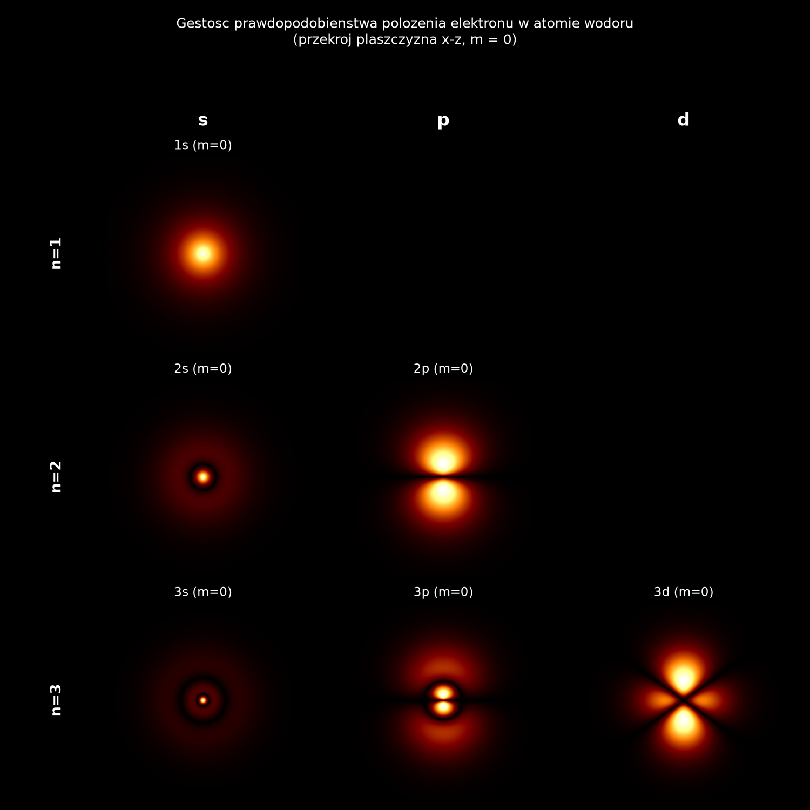

# Gęstość prawdopodobieństwa elektronu w atomie wodoru ⚛️

Interaktywna wizualizacja gęstości prawdopodobieństwa znalezienia elektronu
w atomie wodoru, w zależności od dyskretnych liczb kwantowych **n, l, m** —
otrzymana z analitycznego rozwiązania [równania Schrödingera](https://pl.wikipedia.org/wiki/R%C3%B3wnanie_Schr%C3%B6dingera)
dla potencjału kulombowskiego.



## O co tu chodzi (fizyka w skrócie)

Elektron w atomie wodoru nie krąży po orbicie jak planeta — opisuje go
**funkcja falowa** ψ, a kwadrat jej modułu |ψ|² mówi, jakie jest
prawdopodobieństwo znalezienia elektronu w danym miejscu przestrzeni
(tzw. [gęstość prawdopodobieństwa](https://pl.wikipedia.org/wiki/Funkcja_g%C4%99sto%C5%9Bci_prawdopodobie%C5%84stwa)).

Rozwiązanie równania Schrödingera dla atomu wodoru rozdziela się na część
radialną i kątową:

```
psi_nlm(r, theta, phi) = R_nl(r) * Y_lm(theta, phi)
```

Trzy dyskretne [liczby kwantowe](https://pl.wikipedia.org/wiki/Liczby_kwantowe) opisują stan elektronu:

| Liczba | Nazwa | Zakres | Co określa |
|---|---|---|---|
| `n` | główna | 1, 2, 3, ... | rozmiar i energię orbitalu |
| `l` | poboczna | 0 ... n-1 | kształt orbitalu (0=s, 1=p, 2=d, ...) |
| `m` | magnetyczna | -l ... l | orientację orbitalu w przestrzeni |

Ciekawostka wykorzystana w projekcie: |ψ|² **nie zależy od kąta φ**
(azymutalnego) — dzięki temu cały obraz gęstości można pokazać na jednym
płaskim przekroju (płaszczyzna x-z), tak jak na podręcznikowych rysunkach
orbitali.

Na wykresach widać charakterystyczne cechy:
- **węzły radialne** (`n - l - 1`) — "pierścienie", w których gęstość spada do zera,
- **węzły kątowe** (`l`) — płaszczyzny/powierzchnie, w których gęstość spada do zera (np. charakterystyczna "przewężka" orbitalu p).

## Struktura projektu

```
hydrogen-orbital-density/
├── hydrogen_orbital.py     # rdzeń fizyczny: R_nl(r), Y_lm, gęstość prawdopodobieństwa
├── interactive_viewer.py   # aplikacja z suwakami n, l, m (uruchom to!)
├── orbital_grid.py         # generuje siatkę porównawczą 3x3 (obrazek wyżej)
├── requirements.txt
├── LICENSE
└── .gitignore
```

## Instalacja i uruchomienie

```bash
git clone <adres-twojego-repo>
cd hydrogen-orbital-density
pip install -r requirements.txt

# interaktywny eksplorator (suwaki n, l, m)
python interactive_viewer.py

# generowanie siatki porównawczej 3x3 (jak obrazek wyżej)
python orbital_grid.py
```

W `interactive_viewer.py` suwakami wybierasz `n`, `l`, `m` — niedozwolone
kombinacje są automatycznie ograniczane (np. dla `n=1` `l` i `m` zawsze
wrócą do 0, bo fizycznie `l <= n-1` i `|m| <= l`).

Nawigacja po wykresie myszką:
- **przeciągnięcie lewym przyciskiem** — przesuwa widok (pan),
- **scroll** — przybliża/oddala (zoom, wyśrodkowany na kursorze),
- **"Resetuj widok"** — wraca do domyślnego przybliżenia dla aktualnego `n`.

Przyciski: **"Losowy orbital"** losuje dowolną dozwoloną kombinację `n,l,m`,
a **"Zapisz PNG"** zapisuje aktualny widok (razem z aktualnym
przybliżeniem/przesunięciem) do pliku.

## Bajery 🎨

- Kolorystyka `afmhot` (czarne tło, żarzący się pomarańcz) — dla klimatu "świecącej chmury elektronowej".
- Skalowanie pierwiastkowe jasności (`sqrt(gęstość)`) — surowa gęstość ma bardzo ostry pik przy jądrze, przez co słabsze, dalsze pierścienie byłyby niewidoczne. Wpływa to tylko na wyświetlanie, nie na dane fizyczne (sprawdzone: całka z gęstości po całej przestrzeni = 1, patrz niżej).
- Losowanie orbitalu jednym przyciskiem.
- Krótkie "fun facty" o kształcie orbitalu (s/p/d) wyświetlane na żywo pod wykresem.
- Automatyczne dopasowanie zasięgu wykresu do `n` (promień zawierający 99% prawdopodobieństwa radialnego), więc chmura zawsze ładnie wypełnia kadr.

## Poprawność fizyczna

Funkcje w `hydrogen_orbital.py` są znormalizowane zgodnie z definicją: dla
dowolnych dozwolonych `n, l, m`

```
∫∫∫ |psi_nlm(r, theta, phi)|² r² sin(theta) dr dtheta dphi = 1
```

co zostało sprawdzone numerycznie w trakcie budowy projektu (odchylenie < 10⁻⁶).

## Jak wrzucić to na GitHuba (pierwszy raz)

1. Załóż puste repozytorium na [github.com](https://github.com/new) (bez README/licencji — te już masz).
2. W folderze projektu:
   ```bash
   git init
   git add .
   git commit -m "Pierwsza wersja: gęstość prawdopodobieństwa elektronu w atomie wodoru"
   git branch -M main
   git remote add origin https://github.com/<twoj-login>/hydrogen-orbital-density.git
   git push -u origin main
   ```
3. Gotowe — na stronie repo warto od razu wrzucić `orbital_grid.png` jako
   podgląd (już jest w projekcie, GitHub pokaże go automatycznie w README).

## Możliwe rozszerzenia

- Wizualizacja 3D (np. `plotly` lub `mayavi`) zamiast przekroju 2D.
- Atomy wodoropodobne (He⁺, Li²⁺...) — wystarczy dodać liczbę atomową Z do wzoru na R_nl.
- Eksport animacji (GIF) pokazującej przejście n=1 → n=3.

## Licencja

MIT — rób z tym, co chcesz.
